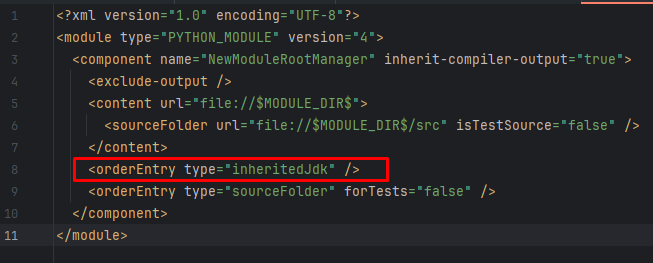
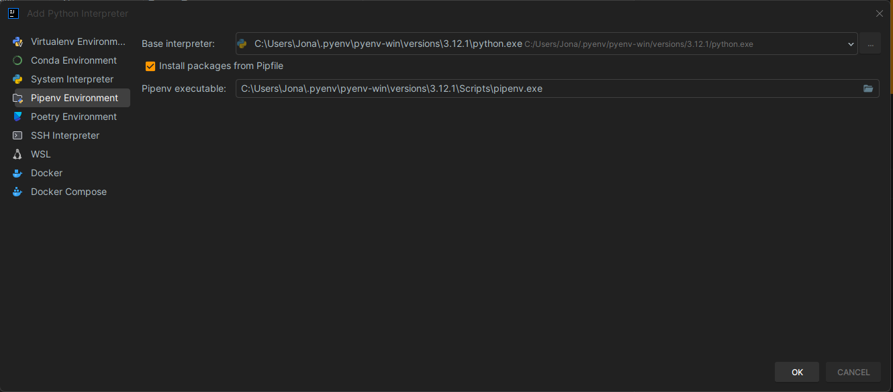
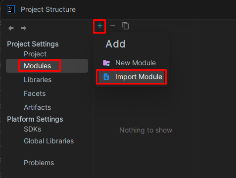
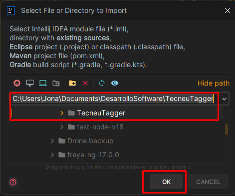
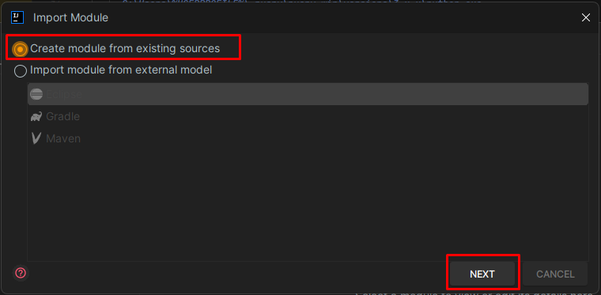

## 🚀 Configuración del Entorno

1. **Instala Pyenv**
    - Windows: `pip install pyenv-win`
      - Establecer las siguientes rutas en la variable de entorno Path, en la parte superior, para que asigne prioridad a las versiones de python de pyenv-win sobre cualquier otra previamente instalada en el equipo, es importante establecer `/shims` en la parte superior:
      ```bash
      %USERPROFILE%\.pyenv\pyenv-win\shims
      %USERPROFILE%\.pyenv\pyenv-win\bin
    - Linux/MacOS: Seguir instrucciones de https://github.com/pyenv/pyenv

2. **Configura Pyenv**
   - Instalar la version de Python especificada en el archivo Pipfile: `pyenv install 3.x.x`
   - Asignar version instalada de uso global en el equipo: `pyenv global 3.x.x` o de uso local `pyenv local 3.x.x`
   - Verificar correcta selección de version de python en el equipo:
   ```bash
   pyenv global
   python --version

3. **Pipenv**
   - Instalarlo globalmente (Si prefieres evitar problemas de permisos): `python -m pip install pipenv` o localmente: `pip install --user pipenv`.
   - Ejecuta el comando `pyenv rehash` para detectar tu nueva instalación de pipenv y crear un shim.
   - Verificar instalación: `pipenv --version`.
   - Activar el entorno virtual del proyecto: `pipenv shell`.
   - Eliminar entorno virtual anterior para evitar problemas de versiones de Python antiguas (solo de ser necesario): `pipenv --rm`.
   - Se recomienda asignar también la version local de python con pyenv, ya que evita problemas/perdida de tiempo (a pesar de que se haya asignado también con `pyenv global`) `pyenv local 3.x.x`.
   - Instalar dependencias `pipenv install` o para uso en Producción (Entornos Estables) instala versiones exactas según Pipfile.lock`pipenv install --deploy --ignore-pipfile`.
   - Ejecutar main.py: `python src/main.py`.
   - Salir del entorno virtual: `exit`.

## Otros

1. **Configuración de Intellij IDEA**
   - Asegurar que el archivo .iml del proyecto no especifique ninguna version/nombre del SDK en especifico. En cambio permitir que IntelliJ IDEA determine el SDK basado en la configuración del proyecto o de los ajustes globales del IDE:
   
   - Configurar que IntelliJ cree y gestione un entorno Pipenv:
     - Abrir la configuración de estructura del proyecto (Ctrl + Alt + Shift + S).
     - En el menu 'SDK' Haz clic en Add Interpreter o 'Add SDK' → selecciona Pipenv Environment (panel izquierdo).
     - En Base interpreter, elige: 
     ```bash
     C:\Users\%USERPROFILE%\.pyenv\pyenv-win\versions\3.x.x\python.exe
     ```
     - En Pipenv executable, puedes dejarlo en blanco si tu PATH incluye la carpeta “shims” o “Scripts” de pyenv, o puedes buscar el pipenv.exe correspondiente, algo como:
     ```bash
     C:\Users\%USERPROFILE%\.pyenv\pyenv-win\versions\3.x.x\Scripts\pipenv.exe
     ```
     
   - Ir a la configuración y seleccionar en el menu `Project Structure > Modules > Add > Import Module > Create module from existing sources > Create`, seleccionar el Path raíz del proyecto que contiene el directorio `.idea` y el archivo `.iml`*:
   
   - Instala Black, para aplicar formato desde Intellij (Opcional):
     - Instala black con su daemon, fuera del proyecto (en la version de python global asignada por pyenv):
      ```bash
      pip install black[d]
      ```
     - Instala el plugin BlackConnect y accede a su configuración `File > Settings... > Tools > BlackConnect`, asigna el local instance con el path especifico, por ejemplo:
      ```bash
      C:\Users\%USERPROFILE%\.pyenv\pyenv-win\shims\blackd.bat
      ```
   
2. **Actualizar dependencias necesarias para el proyecto**
   ```bash
   pip freeze > requirements.txt
   
3. **Regenera el lock (opcional si cambias a un Pipfile)**
   - Tras editar el Pipfile, ejecuta `pipenv lock`.
   - Luego vuelve a instalar: `pipenv install`
   
4. **Crear ejecutable**
    - Con instrucciones de .spec (Recomendable): `pyinstaller main.spec`
    - Ejecutable inline con icono: `pyinstaller --onefile --windowed --icon=assets/logos/tecneu-logo.ico main.spec`

5. **Ejecutar Tests (`test`)**
   -  Usa pytest y pytest-qt para probar la aplicación y widgets de PyQt.
   - Comando:
   ```bash
   pipenv run pytest
   ```
   - Para ejecutar solo un archivo de test específico, por ejemplo `test_carousel.py`:
   - Comando:
   ```bash
   pipenv run pytest tests/test_carousel.py
   ```
## Scripts de Desarrollo

El proyecto define algunos **scripts** en él `Pipfile` para simplificar tareas comunes:

1. **Formatear código** (`format`):
    - Ejecuta [Black](https://black.readthedocs.io/en/stable/) e [isort](https://pycqa.github.io/isort/) para un formateo de código consistente.
    - Comando:
      ```bash
      pipenv run format
      ```
    - Este comando hará:
        - `black .` (formateo)
        - `isort .` (ordenar imports)

2. **Lint** (`lint`):
    - Usa [Flake8](https://flake8.pycqa.org/en/latest/) y [Pylint](https://pylint.pycqa.org/en/latest/) para revisar estilo y convenciones de código.
    - Comando:
      ```bash
      pipenv run lint
      ```
    - Este comando hará:
        - `flake8 .` (detección de errores, estilo, etc.)
        - `pylint .` (análisis detallado y puntuación de código)

3. **Chequeo de tipos** (`typecheck`):
    - Corre [mypy](http://mypy-lang.org/) para verificar anotaciones y consistencia de tipos en el proyecto.
    - Comando:
      ```bash
      pipenv run typecheck
      ```
    - Si detecta inconsistencias de tipos, mypy mostrará los errores en la consola.

> **Nota**: En Windows, los scripts usan `cmd /c "..."` para poder encadenar comandos con `&&`.
> En caso de que tengas problemas con `&&` en **PowerShell**, podrías separar cada herramienta en distintos scripts (por ejemplo, `format_black` y `format_isort`) o usar un archivo `.bat`.


## Producción (Crear instalable):

1. **Crear ejecutable**
   - Asociar extension `*.spec` a Python (Opcional):
     - En IntelliJ, ve a Settings > Editor > File Types. 
     - Luego, en “Python” (o “Python File”), añade el patrón `*.spec`.
   - Crear ejecutable que se necesita para crear el instalador `pyinstaller main.spec`, esto debera generar un ejecutable .exe que terminara en el directorio `/dist/main.exe`.

2. **Crear instalador**
   - Se requiere tener previamente instalado el software [Inno Setup Compiler](https://jrsoftware.org/isdl.php).
   - Con ese software debes de abrir el archivo `InnoSetup.iss` que se encuentra dentro de este proyecto.
